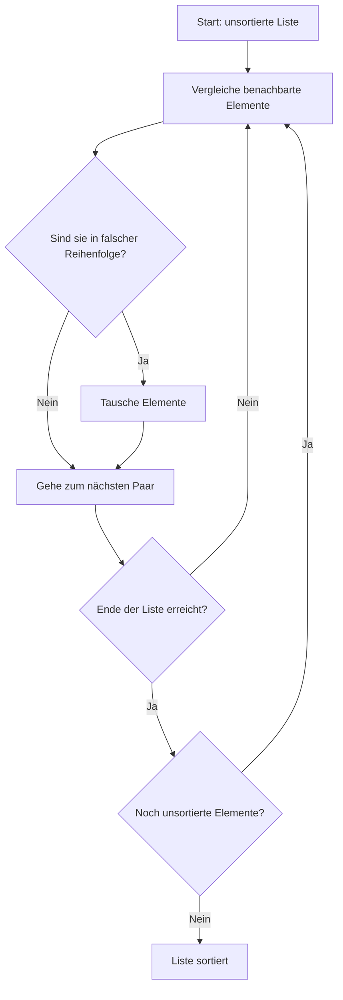

# Bubble sort

**Beschreibung:**

*   Vergleicht benachbarte Elemente und vertauscht sie, wenn sie in der falschen Reihenfolge sind.
*   Dieser Vorgang wird wiederholt, bis die Liste sortiert ist.
*   **Komplexität:**
    *   Best Case: O(n) (wenn schon sortiert)
    *   Worst Case: O(n²)

**Eigenschaften:**

*   Einfach zu verstehen, aber ineffizient für große Listen.

**Python-Beispiel:**

```python
def bubble_sort(liste):
    n = len(liste)
    for i in range(n):
        for j in range(0, n - i - 1):
            if liste[j] > liste[j + 1]:
                liste[j], liste[j + 1] = liste[j + 1], liste[j]
    return liste

# Beispiel
daten = [64, 34, 25, 12, 22, 11, 90]
print(bubble_sort(daten))  # Ausgabe: [11, 12, 22, 25, 34, 64, 90]
```
**Grafische Darstellung**

