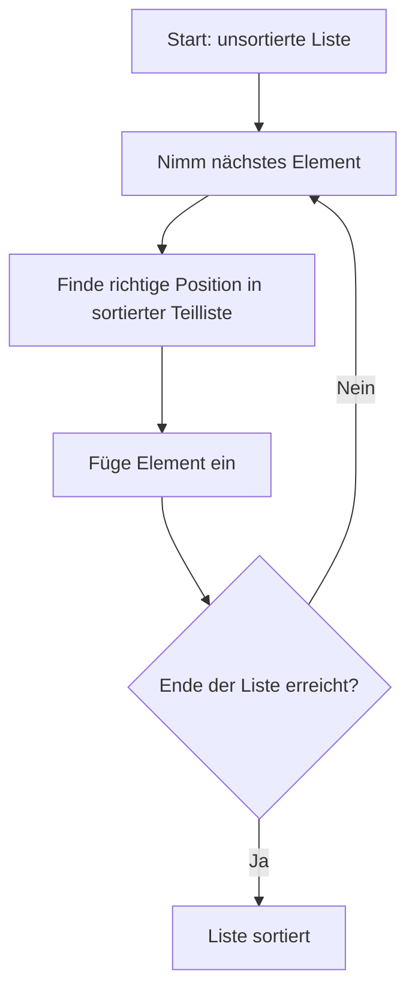

# Insertion sort

**Beschreibung:**

*   Baut die sortierte Liste schrittweise auf.
*   Nimmt jedes Element und fügt es an der richtigen Stelle in die bereits sortierte Teilliste ein.
*   **Komplexität:**
    *   Best Case: O(n) (fast sortiert)
    *   Worst Case: O(n²)

**Eigenschaften:**

*   Gut für kleine oder fast sortierte Listen.

**Python-Beispiel:**

```python
def insertion_sort(liste):
    for i in range(1, len(liste)):
        key = liste[i]
        j = i - 1
        while j >= 0 and liste[j] > key:
            liste[j + 1] = liste[j]
            j -= 1
        liste[j + 1] = key
    return liste

# Beispiel
daten = [12, 11, 13, 5, 6]
print(insertion_sort(daten))  # Ausgabe: [5, 6, 11, 12, 13]
```

**Grafische Darstellung**

