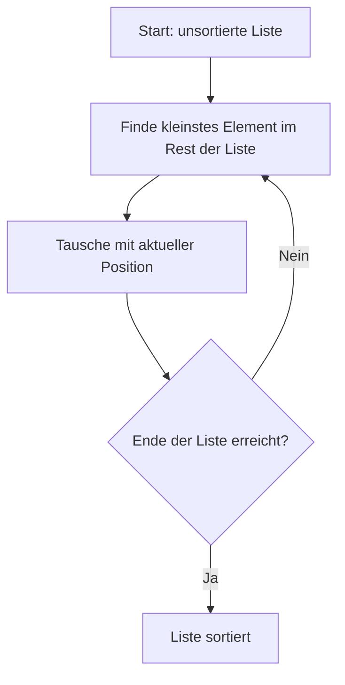

# Selection sort

**Beschreibung:**

*   Sucht das kleinste Element und tauscht es mit dem ersten Element.
*   Dann sucht das nächste kleinste und tauscht es mit dem zweiten Element usw.
*   **Komplexität:**
    *   Best/Worst Case: O(n²)

**Eigenschaften:**

*   Weniger Tauschoperationen als Bubble Sort, aber immer noch ineffizient für große Listen.

**Python-Beispiel:**

```python
def selection_sort(liste):
    n = len(liste)
    for i in range(n):
        min_index = i
        for j in range(i + 1, n):
            if liste[j] < liste[min_index]:
                min_index = j
        liste[i], liste[min_index] = liste[min_index], liste[i]
    return liste

# Beispiel
daten = [64, 25, 12, 22, 11]
print(selection_sort(daten))  # Ausgabe: [11, 12, 22, 25, 64]
```

**Grafische Darstelllung**

