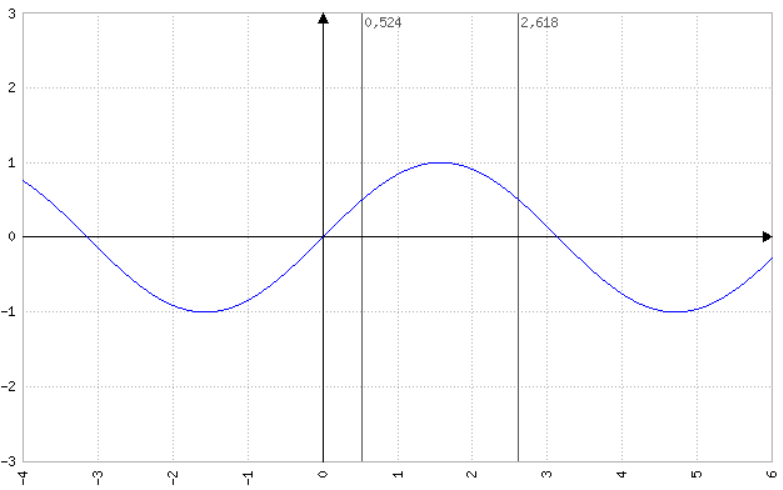
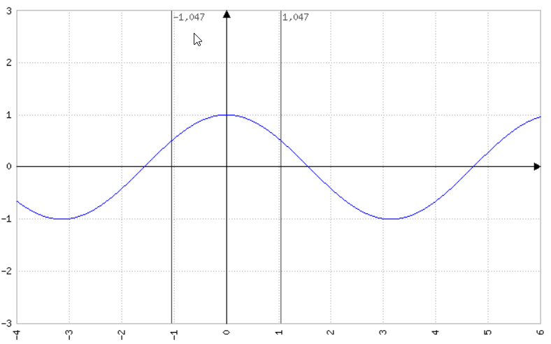

# Lösen von trigonometrischen Gleichungen

## Gleichungen der Form sin(x)=a und cos(x)=a

Als periodische Funktionen besitzen diese grundsätzlich unendlich viele Lösungen. Man berechnet
darum immer eine __Basislösung__ welche dann in das gewünschte Intervall __transferiert__ wird.

Für die Lösung der Gleichung wird die Umkehrfunktion $arcsin(x)$ bzw. $arccos(x)$ benötigt. Es gilt:

$arcsin(sin(x))=x$

Wollen wir die erste Basislösung von

$sin(x)=0,5$

berechnen. Dann brauchen wir nur

$arcsin(sin(x))=arcsin(0,5)$

$x_{0} = arcsin(0,5) \approx 0,534$

Die zweite Basislösung erhalten wir, in dem wir die Symetrie und die Periodenlänge der Funktion ($2\pi$) ausnutzen:

$x'_0 = \pi-x_0$

$x'_0 = \pi - 0,534 \approx 2,618$

Wird die Lösung in einem anderen Intervall als $0 \leq x \leq 2\pi$ erwartet, brauchst du die Basislösung nur um

$n \cdot 2\pi$

zu verschieben.

!!! warning "Rechnen mit dem Taschenrechner"

    Wir rechnen hier im Bogenmaß! Die Funktionen $arcsin$ bzw. $arccos$ werden auf dem Taschenrechner auch mit
    $sin^{-1}$ bzw. $cos^{-1}$ bezeichnet

Für die Gleichung $cos(x)=a$ gehst du genauso vor. Bechte nur, das sich die zweite Basislösung durch die Symetrie
zur Y-Achse ergibt aus:

$x'_{0}=-x_{0}$

also im negativen Bereich liegt und ggf. um die Periodenlänge $2\pi$ verschoben werden muss.

## Gleichungen der Form sin(bx+c)=a

Solche Gleichungen lassen sich leicht lösen in dem du die Hilfsvariable u verwendest:

$sin(u)=a$

dann gehst du wie oben dargestellt vor. Die Lösung für u setzt du dann in folgende Gleichung ein:

$bx+c=u$

und löst nach x auf:

$x_{0} = \frac{u-c}{b}$

Die zweite Basislösung berechnest du ebenfalls auf der Basis von u! D.h. zunächst berechnest du

$u'= \pi - u$

da es ja eine Sinusfunktion ist (siehe oben). Dann setzt du u' in die in die Gleichung für u ein:

$x'_{0} = \frac{u'-c}{b}$

Liegen die Werte nicht im richtigen Intervall, dann müssen sie natürlich auch verschoben werden. Hier
muss dann allerdings u.U. die geänderte Periodenlänge berücksichtigt werden. In unserem beispiel wäre die
Periode

$\frac{2\pi}{b}$

!!! warning "und mit cosinus?"
    
    Das lässt sich genau so natürlich auch auf die Funktion

    $cos(bx+c)=a$

    anwenden.

