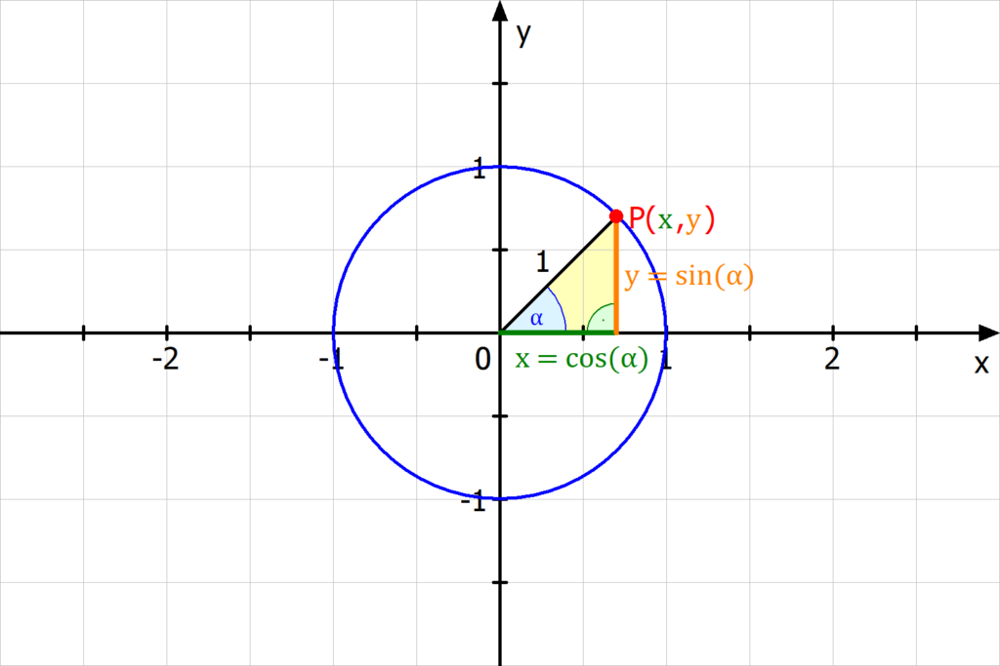
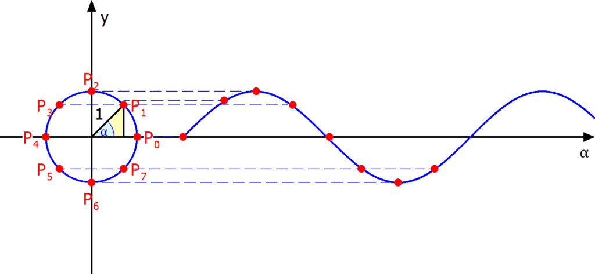

# Einzeitskreis

## Definition

Der Einzeitskreis hat einen Radius von 1:

!!! warning "Definition des Einzeitskreises"

    $$Einzeitskreis=\{P|x^2+y^2=1\}$$

## Winkelfunktion

Die Sinus-Funktion über den Einheitskreis dargestellt:

## Bogenmaß und Gradmaß

Das Bogenmaß ist über den Einzeitskreis definiert. Der Umfang eine Kreises ist

$u=2\pi*r$

im Einheitskreis ist der Radius $r=2$, darum gilt:

$u=2\pi$

Der Winkel eines Vollen Kreises beträgt $360^{\circ}$ damit gilt:

$2\pi\equiv360^{\circ}$

oder

$\pi\equiv180^{\circ}$

!!! warning "Umrechung Grand in Bogenmaß"

    $$x_{RAD}=\frac{x_{DEG}}{180^{\circ}}\cdot\pi$$

    $$x_{DEG}=\frac{180^{\circ}}{\pi}\cdot x_{RAD}$$

