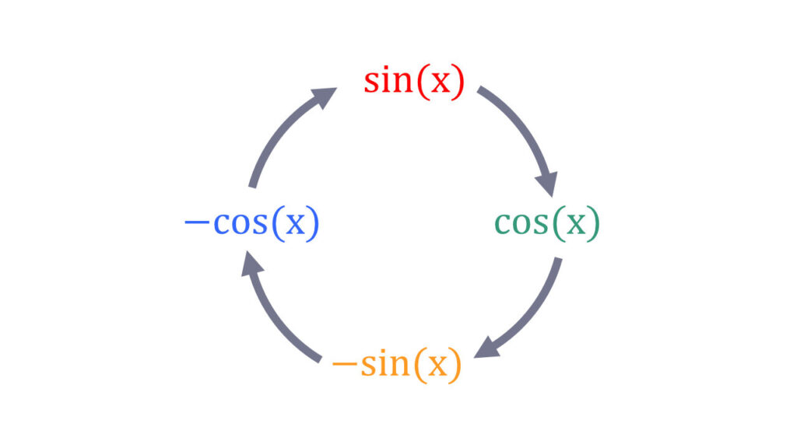

# Sinus und Cosinus Ableiten

## Der Ableitungszirkel der Sinus- und Cosinus-Funktiion

## Kettenregel

Die Kettenregel wird bei verschachtelten Funktionen angewendet

!!! warning "Kettenregel"

    $$u \equiv äußere Funktion$$

    $$v \equiv innere Funktion$$

    $$f(x)=u(v(x) \to f'(x)=u'(v(x)) \cdot v'(x)$$

### Beispiel

$f(x) = sin(3x)$

$f'(x) = cos(3x) \cdot 3 = 3 \cdot cos(3x)$

## Produktregel

Die Produktregel wird bei Multiplikation von zwei Funktionen angewendet

!!! warning "Produktregel"

    $$f(x)=u(x) \cdot v(x) \to f'(x)=u'(x) \cdot v(x) + u(x) \cdot v'(x)$$

### Beispiel

$f(x) = x^2 \cdot cos(x)$

$f'(x) = 2x \cdot cos(x) + x^2 \cdot -sin(x)$

### Beispiel für Ketten- und Produktregel

$f(x) = x \cdot cos(2x-1)$

zerlegen für Produktregel

$u(x) = x \to u'(x) = 1$

$v(x) = cos(2x-1) 

anwenden der Kettenregel

$v'(x) = -sin(2x-1) \cdot 2 = -2 \cdot sin(2x-1)$

einsetzen in Produktregel

$f'(x) = u'(x) \cdot v(x) + u(x) \cdot v'(x)$

$f'(x) = 1 \cdot cos(2x-1) + x \cdot -2 \cdot sin(2x-1)$

$f'(x) = cos(2x-1) -2x \cdot sin(2x-1)$
