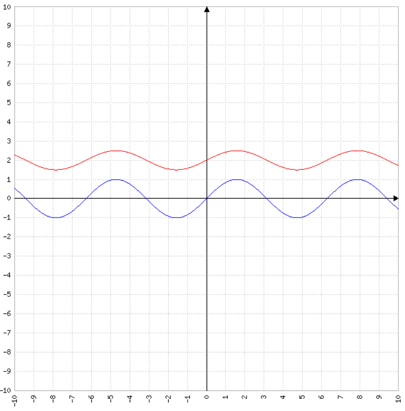
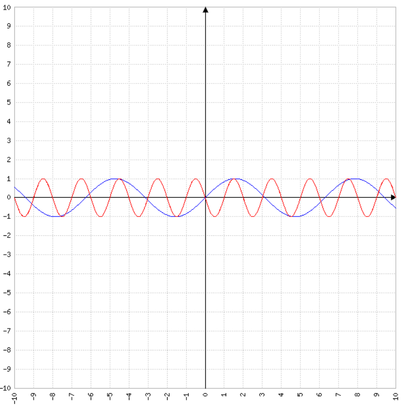
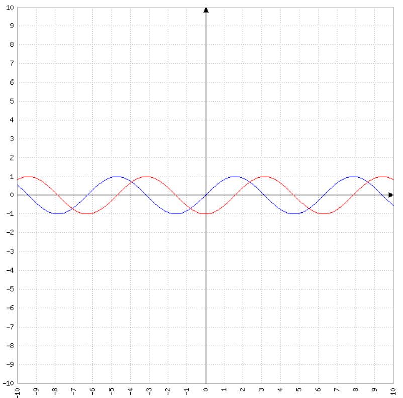

# Modifikationen von sin(x) und cos(x)

??? Tip "allgem. Form der mod. sin-Funktion"

    $f(x)=a\cdot\sin(b\cdot(x-d))+e$
    
    a: Streckung/Stauchung in y-Richtung

    b: Streckung/Stauchung in x-Richtung, Periodenlänge $p=\frac{2\pi}{b}$

    d: Verschiebung in x-Richtung

    e: Verschiebung in y-Richtung

Ermittle den Graphen für folgende Funktionen

1.1 $f(x)=2\cdot sin(x+\pi)$

1.2 $f(x)=2\cdot sin(\pi\cdot x)$

1.3 $f(x)=-1\cdot sin(x)+1$

Überprüfe das Ergebnis mit dem [Funktionsplotter](https://www.mathe-fa.de/de)

Ermittle die Funktion für folgende Graphen

- 2.1 { width="300" }
- 2.2 { width="300" }
- 2.3 { width="300" }

??? success "Lösung"

    2.1 $f(x)=0.5\cdot sin(x)+2$

    2.2 $f(x)=sin(\pi\cdot(x+1))$

    2.3 $f(x)=-1\cdot sin(x+\frac{1}{2}\pi)$
