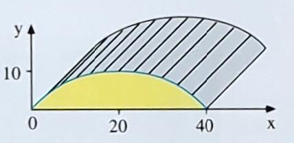

# Seite 25, Beispiel Bahnhofshalle

# Gleichung der Parabel

In die allgemeine Parabelgliechung

$$f(x)=ax^2+bx+c$$

können wir die gegebenen Punkte einsetzen und erhalten die erste Gleichung 

$$f(0) = 0 = a0^2 +b0 + c$$

Daraus folgt direkt $c=0$

Die weiteren Gleichungen sind

$$f(40)=0=a\cdot40^2 + b\cdot40$$

und

$$f(20)=10=a\cdot20^2 + b\cdot20$$

wir lösen die letze Gleichung nach b auf

$$20b = 10 -400a$$

$$b = \frac{10-400a}{20} = \frac{1}{2}-20a $$

und setzen dies in die andere Gleichung ein

$$0=1600a+40b$$

$$0=1600a+40\left(\frac{1}{2}-20a\right)$$

$$0=1600a+20-800a$$

$$-20=800a$$

$$a=-\frac{1}{40}$$

Dann ergibt sich aus der ersten Gleichung

$$b = \frac{1}{2}-20a $$

$$b = \frac{1}{2} - 20 \cdot \left(-\frac{1}{40} \right)$$

$$b = \frac{1}{2} + \frac{1}{2} = 1$$

Und für unsere Parabelgleichung ergibt sich dann

$$f(x)=-\frac{1}{40}x^2+x$$

Die Flächeninhaltsfunktion ermitteln wir dann, in dem wir die Exponenten um jeweils 1 erhöhen und 
dann den sich durch den Kerwert des neuen Exponenten ergebenen Faktor berücksichtigen:

$$A(x)=-\frac{1}{40\cdot3}x^3+\frac{1}{2}x^2 $$

$$A(40)= -\frac{1}{40\cdot3}40^3+\frac{1}{2}40^2 $$

$$A(40)= -\frac{1}{40\cdot3}64000+\frac{1}{2}1600 $$

$$A(40)= -\frac{1}{40\cdot3}64000+800$$

$$A(40)= -\frac{1600}{3}+\frac{2400}{3}=\frac{800}{3}=266,67m^2$$