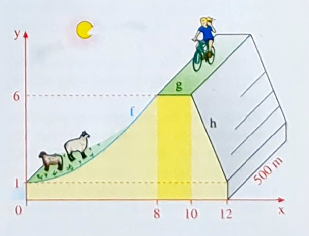

# Seite 25, Übung 13: Schutzdeich

## Gleichung der Parabel

In die allgemeine Parabelgliechung

$$f(x)=ax^2+bx+c$$

können wir die gegebenen Punkte einsetzen und erhalten die erste Gleichung 

$$f(0) = 0 = a0^2 +b0 + c$$

Daraus folgt direkt $c=0$

für den zweiten Punkt erhalten wir

$$f(8) = 5 = a\cdot8^2 + b\cdot8$$

(wir wissen ja schon, das $c=0$ ist und können es weglassen)

eine weitere Gleichung erhalten wir, wenn wir wissen, dass 'der Deich horizontal ausläuft'
denn das bedeutet, dass die Steigung im Punkt x=0 auch Null sein muss. Damit können wir
die erste Ableitung der Parabelgleichung entsprechend verwenden

$$f(x)=2ax+b$$

$$f(0)=0=2a\cdot0 +b$$

und es folgt direkt, das auch $b=0$ sein muss.

Damit bleibt als Gleichung übrig

$$f(8) = 5 = a\cdot8^2$$

$$ 5 = a\cdot64 $$

$$ a = \frac{5}{64} $$

Für die Gleichung ergibt sich also 

$$ f(x) = \frac{5}{64}x^2$$

## Die Fläche unter der Parabel

Nun bilden wir daraus die Flächenfunktion. Diese muss einen Grad höher haben (also 3 statt 2)
Und den Faktor 3, der sich beim Ableiten ergibt, müssen wir kompensieren, in dem wir die Funktion mal
$\frac{1}{3}$ nehmen:

$$F(x)=\frac{5}{64\cdot3}x^3$$

Für die Fläche im Intervall [0, 8] ergibt sich damit

$$F(8)=\frac{5}{64\cdot3}8^3=\frac{512 \cdot 5}{192}= \frac{2560}{192}=13\frac{1}{3}=13,3333$$

## Die anderen Flächen

sind einfache Rechtecke bzw. ein Dreieck:

$$12\cdot1+2\cdot5+\frac{1}{2}(2\cdot5)=27$$

Die Gesamtfläche beträgt also $40,3333m^2$

# Volumen und Gewicht

Durch die Multiplikation mit der Länge von 500m erhalten wir das Volumen

$$ 40,3333m^2 \cdot 500m = 20166,65m^3 $$

Was wiegt ein $m^3$ wenn ein $cm^3$ 1,8g wiegen? Der Faktor wäre dann $100\cdot100\cdot100=1000000$

Wenn wir dann Gramm in Tonnen umrechnen, dann haben wir $1000\cdot1000=1000000$ den gleichen Faktor. Wir
können also sagen, dass ein $m^3$ Sand 1,8 Tonnen wiegen.

Wir nehmen also unser Volumen mal 1,8 Tonnen und Teilen das dann durch 20 Tonnen pro LKW:

$$\frac{20166,65 \cdot 1,8}{20} = 1814,999$$

Es müssen also 1815 LKW Ladungen transportiert werden - wenn ich mich nicht verrechnet habe :-)
