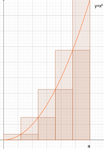

# Die Streifenmethode des Archimedes

Für die Berechnung der Fläche unterhalb eine Funktion lässt sich diese in Streifen zerlegen.

## Erstes Beispiel

### Gegeben ist die Funktion

$$f(x)=x^2$$

im Intervall [0..1]

Die __Obersumme__ für n=4 also 4 Streifen für das Intervall 0..1 berechnet sich wie folgt

$$O_{4}=\frac{1}{4}\left(\left(\frac{1}{4}\right)^2 + \left(\frac{1}{2}\right)^2 + \left(\frac{3}{4}\right)^2 + 1^2 \right)$$

$$0_{4}=\frac{1}{64}+\frac{1}{16}+\frac{9}{64}+\frac{1}{4}=\frac{1+4+9+16}{64}=\frac{30}{64}$$

Die __Untersumme__ für n=4 also 4 Streifen für das Intervall 0..1 berechnet sich wie folgt

$$O_{4}=\frac{1}{4}\left(0+ \left(\frac{1}{4}\right)^2 + \left(\frac{1}{2}\right)^2 + \left(\frac{3}{4}\right)^2 \right)$$

$$0_{4}=\frac{1}{64}+\frac{1}{16}+\frac{9}{64}=\frac{1+4+9}{64}=\frac{14}{64}$$

Der Mittelwert der beiden Werte liegt bei $\frac{22}{64}=0.343$ was schon recht nahe am tatschllichen Wert für die Fläche liegt

### Grenzwertbetrachtung

$$\lim_{n \to \infty} O_{n}= \frac{1}{n} \left( \left(\frac{1}{n}\right)^2 + \left(\frac{2}{n}\right)^2 + \left(\frac{3}{n}\right)^2 ... \left(\frac{n}{n}\right)^2 \right)$$

$$\lim_{n \to \infty} O_{n}= \frac{1}{n} \left( \frac{1^2}{n^2} + \frac{2^2}{n^2} + \frac{3^2}{n^2} ... \frac{n^2}{n^2} \right)$$

$$\lim_{n \to \infty} O_{n}= \frac{1}{n^3} \left( 1^2 + 2^2 + 3^2 ... n^2 \right)$$

Hier können wir die Summenformel für Quadratzahlen einsetzen:

??? Tip "Summenformel für Quadratzahlen"

    $$1^2+2^2+3^2+4^2+...+n^2 = \sum_{k=1}^n k^2 = \frac{n(n+1)(2n+1)}{6}$$

$$\lim_{n \to \infty} O_{n}= \frac{1}{n^3} \left( \frac{n(n+1)(2n+1)}{6} \right)$$

$$\lim_{n \to \infty} O_{n}= \frac{1}{n^3} \left( \frac{1}{6}n(n+1)(2n+1) \right)$$

Jetzt dreimal ausmultiplizieren

$$\lim_{n \to \infty} O_{n}= \frac{1}{n^3} \left( \frac{1}{6}n (2n^2+3n+1) \right)$$

$$\lim_{n \to \infty} O_{n}= \frac{1}{n^3} \left( \frac{1}{3}n^3+ \frac{1}{2}n^2 + \frac{1}{6}n \right)$$

$$\lim_{n \to \infty} O_{n}= \frac{1}{3} + \frac{1}{2n} + \frac{1}{6n^2} $$

$$\lim_{n \to \infty} O_{n}= \frac{1}{3}$$

