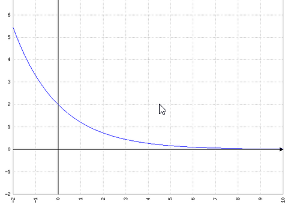

# Uneigentliche Integrale

Die Fläche unter einer Funktion $f(x)$ kann endlich sein, auch ohne rechte Integrationsgrenze. Hier
am Beispiel der Funktion

$f(x)=2\cdot e^{-05x}$

Die Fläche für das Interval [0, k] kann wie folgt berechnet werden:

$A(k)=\int_0^k 2 \cdot e^{-0,5x}dx$

$=\left[ -4\cdot e^{-0,5x} \right]_0^k$

$= (-4\cdot e^{-0,5k}) - (-4)$

$= 4-\frac{4}{e^{0,5k}}$

Eine Grenzwertbetrachtung $k \to  \infty$ liefert dann die Fläche des unbegrenzten Integrals

$\lim\limits_{k \to \infty} A(k) = \lim\limits_{k \to \infty} \left( 4-\frac{4}{e^{0,5k}} \right) = 4$

Beispielaufgabe [Seite 105 Aufgabe 3](../work/ws-buch-s105-a3.md)