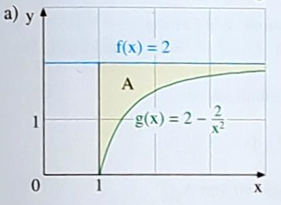

# Seite 105

## Aufgabe 3a

Berechne die Fläche

Die Fläche unter der Funktion $f(x)=2$ ist

$F_1=\int_1^{\infty} 2dx$

$ = \lim\limits_{k \to \infty} \int_1^k 2dx$

$=\lim\limits_{k \to \infty} \left[ 2x \right]_1^k$

$=\lim\limits_{k \to \infty} (2k-2)$

Die Fläche unter der Funktion $f(x)=2-\frac{2}{x^2}$ ist

$F_2=\int_1^{\infty} 2-\frac{2}{x^2}dx$

$=\lim\limits_{k \to \infty} \int_1^k 2-\frac{2}{x^2}dx$

$=\lim\limits_{k \to \infty} \left[ 2x + \frac{2}{x}\right]_1^k$

$=\lim\limits_{k \to \infty} (2k+\frac{2}{k})-(2+2)$

$=\lim\limits_{k \to \infty} (2k+\frac{2}{k}-4)$

Die gesuchte Fläche ist $F_1-F_2$

$F=\lim\limits_{k \to \infty} (2k-2)-(2k+\frac{2}{k}-4)$

$F=\lim\limits_{k \to \infty} (-2-\frac{2}{k}+4)$

$F=\lim\limits_{k \to \infty} (2-\frac{2}{k})$

$F=2$