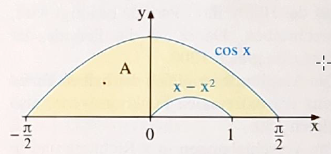

# Seite 127, Aufgabe 16

Berechnen Sie den Inhalt der abgebildeten Fläche A zwischen dem Graphen der Kosinusfunktion, dem Graphen von 
$g(x)=x-x^2$ und der x-Achse

Die Integrationsgrenzen (Nullstellen der Funktionen) sind bereits gegeben. Darum können wir gleich mit der
Flächenberechnung anfangen

$\int_{-\frac{\pi}{2}}^{\frac{\pi}{2}} cos(x)=\left[ sin(x) \right]_{-\frac{\pi}{2}}^{\frac{\pi}{2}}=$

$sin(\frac{\pi}{2})-sin(-\frac{\pi}{2})=1-(-1)=2$

$\int_0^1x-x^2=\left[ \frac{1}{2}x^2-\frac{1}{3}x^3 \right]_0^1=\frac{1}{2}-\frac{1}{3}=\frac{1}{6}$

$A = 2-\frac{1}{6}=\frac{11}{6}$