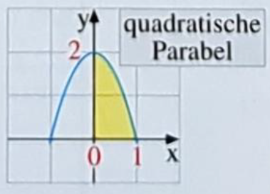

# Seite 51, Aufgabe 1

## a)

$f(x)=x^2-x+1$ im Intervall [0;2]

??? success "Lösung"

    Die Funktion hat im betrachteten Interval keine Nullstelle
    da $x^2$ immer positiv ist und $x \leq x^2$ gilt!

    Wir können also das bestimmte Integral verwenden:

    $\int_0^2 x^2-x+1 = \left| \frac{1}{3}x^3-\frac{1}{2}x^2+x\right|_0^2 = \frac{1}{3}8-\frac{1}{2}4+2 = \frac{8}{3}$

## b)

$f(x)=\frac{1}{x^2}$ in Intervall [1;3]

??? success "Lösung"

    $\int_1^3 \frac{1}{x^2} = \int_1^3 x^{-2} = \left|\frac{1}{-1}x^{-1}\right|_1^3 = \left|-\frac{1}{x} \right|_1^3$

    $\left|-\frac{1}{x} \right|_1^3 = \left(-\frac{1}{3}\right)-\left(-\frac{1}{1}\right) = \frac{2}{3}$

## c)

$f(x)=x^3-x$ im 4. Quadranten

??? success "Lösung"

    Die Funktion hat drei Nullstellen: -1, 0 und 1. Die gesuchte Fläche liegt im Intervall [0; 1] 

    $\int_{0}^{1} x^3-x = \left|\frac{1}{4}x^4-\frac{1}{2}x^2\right|_{0}^{1}$

    $= \left(\frac{1}{4}-\frac{1}{2}\right)-0=-\frac{1}{4}$

## d)

$f(x)=x^3-x$ im Intervall [0;2]

??? success "Lösung"

    Die Funktion hat drei Nullstellen: -1, 0 und 1. Eine davon liegt also im angegebenen Intervall. Darum
    müssen wir die Fläche in zwei Schritten berechnen

    $\int_{0}^1 x^3-x = \left|\frac{1}{4}x^4-\frac{1}{2}x^2\right|_{0}^{1}$
    
    $= \left(\frac{1}{4}-\frac{1}{2}\right)-0=-\frac{1}{4}$
    
    Zweiter Abschnitt
    
    $\int_{1}^2 x^3-x = \left|\frac{1}{4}x^4-\frac{1}{2}x^2\right|_{1}^{2}$
    
    $= \left(\frac{1}{4}16-\frac{1}{2}4\right)-\left(-\frac{1}{4}\right)$
    
    $= 4-2+\frac{1}{4}=2\frac{1}{4}$
    
    Da wir von der ersten Fläche den Betrag benötigen ergibt sich für die Gesamtfläche
    
    $A = 2 \frac{1}{4}+ \left|-\frac{1}{4}\right|=2 \frac{1}{2}$

## e)

??? success "Lösung"

    Die gesuchte Funktion ist quadratisch $a(bx-c)^2+d$ und zur y-Achse symetrisch. Damit wissen wir schon,
    dass b=1 und c=0 sein muss. Zudem ist sie auf der y-Achse verschoben (+2) und gespiegelt.
    Damit wissen wir, dass der Faktor negativ ist. Aus den beiden Nullstellen (x=1, x=-1) können wir leicht den
    Faktor (-2) ermitteln
    
    $f(x)=-2x^2+2$
    
    Wir suchen also das bestimmte Integral
    
    $\int_0^1-2x^2+2=\left|-\frac{2}{3}x^3+2x \right|_0^1$
    
    $=(-\frac{2}{3}+2)-0 = \frac{4}{3}$

