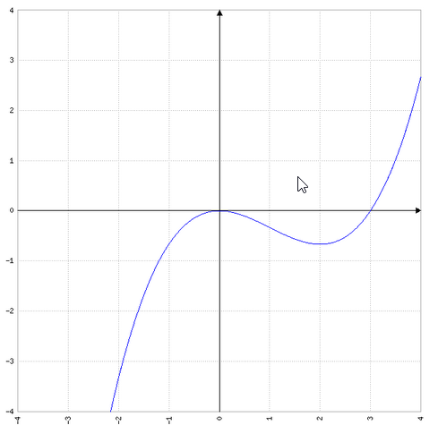
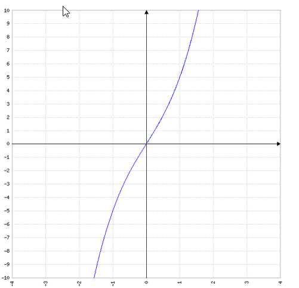
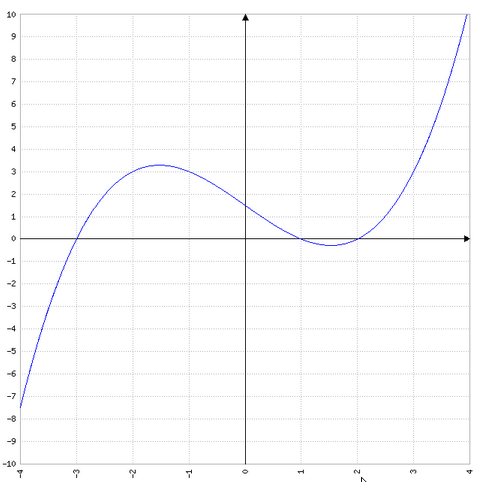
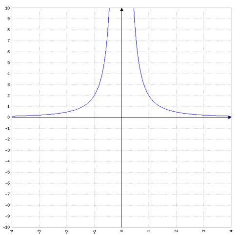

# Seite 52, Aufgabe 2

# a)

$f(x)=\frac{1}{6}x^3-\frac{1}{2}x^2$ Intervall [-1;2]

### Nullstelle berechnen

Zerlegung in Faktoren:

$f(x)=\frac{1}{6}x^2(x-\frac{6}{2})$

$f(0)=0$

$0=x-3$

$f(3)=0$

### best. Integral -1 bis 0

### best. Integral 0 bis 2

# b)

$f(x)=x^3+4x$ Intervall [-3;2]

### Nullstellen berechnen

Zerlegung in Faktoren

$f(x)=x(x^2+4)$

Damit gibt es nur eine Nullstelle bei $f(0)=0$

# c)

$f(x)=\frac{1}{4}(x+3)(x-1)(x-2)$ Intervall [-3;2]

### Nullstellen berechnen

Die Funktion liegt bereits faktorisiert vor, wir können die Nulltellen direkt ablesen

$f(x)=0$ für x=-3 x=1 und x=2

# d)

$f(x)=\frac{2}{x^2}$ Intervall [1;3]

