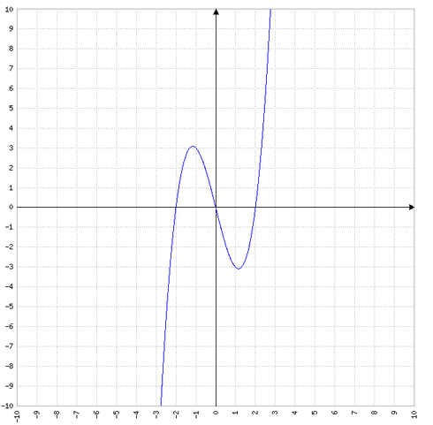

# Seite 52, Aufgabe 2

# a)

$f(x)=\frac{1}{6}x^3-\frac{1}{2}x^2$ Intervall [-1;2]

### Nullstelle berechnen

Zerlegung in Faktoren:

$f(x)=\frac{1}{6}x^2(x-\frac{6}{2})$

$f(0)=0$

$0=x-3$

$f(3)=0$

Da die Nullstelle bei x=0 ein Hochpunkt ist und alle Flächen bis x=3 unterhalb der X-Achse liegen,
braucht man das Integral von -1 bis 2 nicht aufzuteilen:

### best. Integral -1 bis 2

$\int_{-1}^2 \frac{1}{6}x^3-\frac{1}{2}x^2 = \left[ \frac{1}{6 \cdot 4}x^4 - \frac{1}{2 \cdot 3}x^3 \right]_{-1}^2$

$=\left( \frac{1}{24}\cdot16 - \frac{1}{6}\cdot8 \right)-\left(\frac{1}{24}\cdot1 - \frac{1}{6}\cdot -1 \right)= \left( \frac{2}{3}-\frac{4}{3} \right) -\left(\frac{1}{24} +\frac{4}{24}\right) = -\frac{5}{24}$

$-\frac{2}{3}-\frac{5}{24} =-\frac{21}{24}=-\frac{7}{8}$

---
# b.1)

$f(x)=x^3+4x$ Intervall [-3;2]

### Nullstellen berechnen

Zerlegung in Faktoren

$f(x)=x(x^2+4)$

Damit gibt es nur eine Nullstelle bei $f(0)=0$

### best. Integral [-3;0]

$\int_{-3}^0 x^3+4x = \left[ \frac{1}{4}x^4+\frac{4}{2}x^2 \right]_{-3}^{0} = 0 - \left( \frac{81}{4}+\frac{36}{2} \right)$

$= -\frac{153}{4}$

### best. Integral [0;2]

$\int_{0}^2 x^3+4x = \left[ \frac{1}{4}x^4+\frac{4}{2}x^2 \right]_{0}^{2} = \left( \frac{16}{4}+\frac{16}{2} \right) -0$

$=4+8=12$

Die Gesamtfläche beträgt also $12+38\frac{1}{4}=50\frac{1}{4}$

---
# b.2)

$f(x)=x^3-4x$ Intervall [-3;2]

### Nullstellen berechnen

Zerlegung in Faktoren

$f(x)=x(x^2-4)$

Damit gibt es eine Nullstelle bei $f(0)=0$

Aus der Gleichung

$x^2-4=0$

$x^2=4$

Ergeben sich dann weitere Nullstellen bei 2 und -2

### best. Integral [-3;-2]

$\int_{-3}^0 x^3-4x = \left[ \frac{1}{4}x^4-\frac{4}{2}x^2 \right]_{-3}^{-2} = \frac{16}{4}-\frac{16}{2} - \left( \frac{81}{4}-\frac{36}{2} \right)$

$= -\frac{65}{4}+\frac{20}{2}=-16\frac{1}{4}+10=-6\frac{1}{4}$

### best. Integral [-2;0]

$\int_{-2}^0 x^3-4x = \left[ \frac{1}{4}x^4-\frac{4}{2}x^2 \right]_{-2}^{0} = 0- \left( \frac{16}{4}-\frac{16}{2} \right)$

$=-4+8=4$

### best. Integral [0;2]

$\int_{0}^2 x^3-4x = \left[ \frac{1}{4}x^4-\frac{4}{2}x^2 \right]_{0}^{2} = \left( \frac{16}{4}-\frac{16}{2} \right) -0$

$=4-8=-4$

Die Gesamtfläche beträgt also $6\frac{1}{4}+4+4=14\frac{1}{4}$

---
# c)

$f(x)=\frac{1}{4}(x+3)(x-1)(x-2)$ Intervall [-3;2]

### Nullstellen berechnen

Die Funktion liegt bereits faktorisiert vor, wir können die Nulltellen direkt ablesen

$f(x)=0$ für x=-3 x=1 und x=2

### best. Integral [-3; 1]

Zunächst müssen wir die Funktion durch Ausmultiplizieren in die richtige Form bringen

$\int_{-3}^1 \frac{1}{4} \left(x^3-7x+6 \right)$

dann können wir die Stammfunktion ermitteln:

$\frac{1}{4}\left[ \frac{1}{4}x^4-\frac{7}{2}x^2+6x \right]_{-3}^1 = \frac{1}{4}\left(\frac{1}{4}-\frac{7}{2}+6 \right) - \frac{1}{4}\left( \frac{81}{4}-\frac{63}{2}-18  \right)$

$=-\frac{80}{16}+\frac{56}{8}+6 = -5+7+6=8$

### best. Integral [1; 2]

$\frac{1}{4}\left[ \frac{1}{4}x^4-\frac{7}{2}x^2+6x \right]_{1}^2 = \frac{1}{4}\left(\frac{16}{4}-\frac{28}{2}+12 \right) -  \frac{1}{4}\left(\frac{1}{4}-\frac{7}{2}+6 \right)$

$=\frac{16}{16}-\frac{28}{8}+3-\frac{1}{16}+\frac{7}{8}-\frac{6}{4}= \frac{16}{16}-\frac{56}{16}+\frac{48}{16}-\frac{1}{16}+\frac{14}{16}-\frac{24}{16}=-\frac{3}{16}$

Die Gesamtfläche ist also $A=8\frac{3}{16}$

---
# d)

$f(x)=\frac{2}{x^2}$ Intervall [1;3]

### Nullstelle berechnen

Da in der Funktion nur ein x^2 vorkommt ergeben sich nur positive Werte, es gibt keine Nullstelle. Allerdings
ist zu beachten, dass die Funktion für x=0 nicht definiert ist, das gesuchte Intervall stellt aber kein Problem dar.

### best. Integral [1;3]

$\int_1^3 \frac{2}{x^2} = \int_1^3 2x^{-2}=\left[ -2x^{-1} \right]_1^3$

$= \left[ -\frac{2}{x} \right]_1^3 = -\frac{2}{3} - \left(-2 \right)=1\frac{1}{3}$
