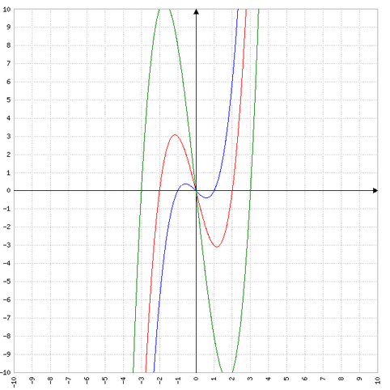

# Buch Seite 55, Aufgabe 7

Gegeben ist die Funktion $f_a(x)=x^3-a^2x, a>0$

Wie muss a gewählt werden, damit die beiden von $f_a$ und der x-Achse eingeschlossenen Flächen jeweils den Inhalt 4 haben?

## Berechnung der Integrationsgrenzen = Nullstellen

$0=x^3-a^2x$

$0=x(x^2-a^2)$

Wir haben also eine Nullstelle bei $x=0$

$0=x^2-a^2$

$a^2=x^2$

$a=x$ bzw. $-a=x$

Damit haben wir zwei weitere Nullstellen bei x=a und x=-a

## Wir betrachten das Integral im Intervall [0; a]

$\int_0^a x^3-a^2x = \left[ \frac{1}{4}x^4-\frac{1}{2}a^2x^2 \right]_0^a$

Daraus folgt

$-4=\frac{1}{4}a^4-\frac{1}{2}a^2a^2 = \frac{1}{4}a^4-\frac{1}{2}a^4=-\frac{1}{4}a^4$

$16=a^4$

$a=2$