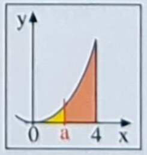

# Buch Seite 55, Aufgabe 8

Die Fläche unter $f(x)=x^2$ über [0;4] soll durch eine senkrechte Gerade x=a im Verhältnis 1:7 geteilt werden.
Wie muss a gewählt werden?

## Schritt 1: Berechnung der Gesamtfläche

$\int_0^4 x^2 = \left[ \frac{1}{3}x^3 \right]_0^4=\frac{64}{3}$

## Schritt 2: Aufteilung der Fläche

$\frac{64}{3}:8=\frac{8}{3}$

## Schritt 3: Berechnung von a

$\frac{8}{3}=\left[ \frac{1}{3}x^3 \right]_0^a=\frac{1}{3}a^3$

$8=a^3$

$a=2$

