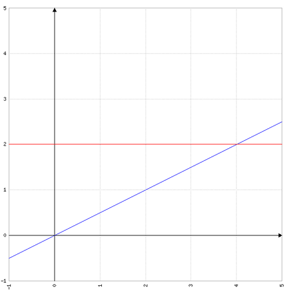
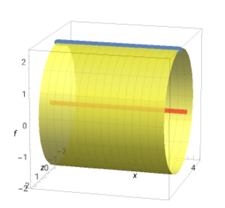

# Seite 93, Aufgabe 11 (Rotationskörper)

Rotation eines Dreiecks

Das Dreieck mit den Eckpunkten a(0|0), B(4,2) und C(0|2) rotiert um die x-Achse. Berechnen Sie das Volumen
des entstehenden Rotationskörpers.

Das Volumen kann berechnet werden in dem das Volumen des Rotationskörpers (Kegel) der sich 
durch die untere blaue Funktion ergibt vom Volumen des Rotationskörpers (Zylinder) der sich durch die obere
rote Funktion ergibt, abgezogen wird.

**Zylinderfunktion:**

$f(x)=2$

**Kegelfunktion:**

$g(x)=\frac{1}{2}x$

## Volumen des Zylinders

$V_z=\pi \int_0^4 2^2 = \pi \left [ 4x\right ]_0^4= 16\pi$

## Volumen des Kegels

$V_k=\pi \int_0^4 (\frac{1}{2}x)^2$

$V_k=\pi \int_0^4 \frac{1}{4}x^2 = \pi \left [ \frac{1}{12}x^3 \right ]_0^4= \frac{64}{12}\pi = \frac{16}{3}\pi$

## Das Volumen des Rotationsdreiecks

$V_z - V_k = 16\pi - \frac{16}{3}\pi = \frac{48}{3}\pi - \frac{16}{3}\pi = \frac{32}{3}\pi$

___
Damit haben wir auch die Volumenformeln von Zylinder und Kegel bewiesen :-)

$V_z = \pi r^2h$

$V_k = \frac{1}{3}\pi r^2h$